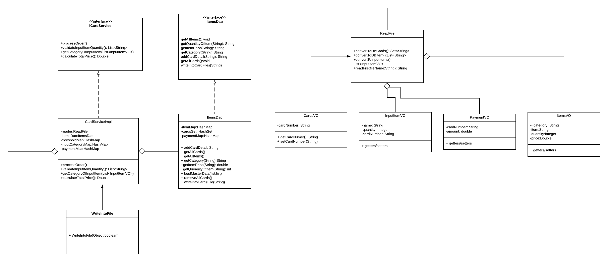
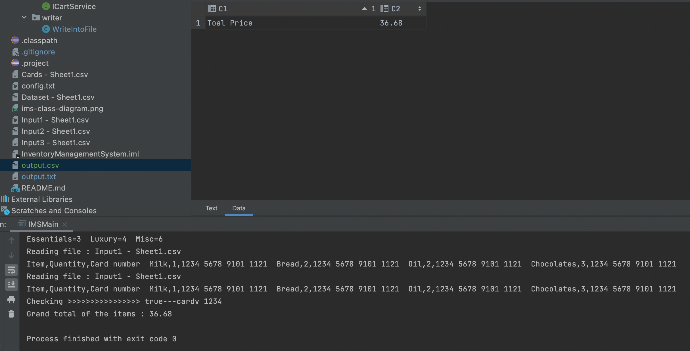
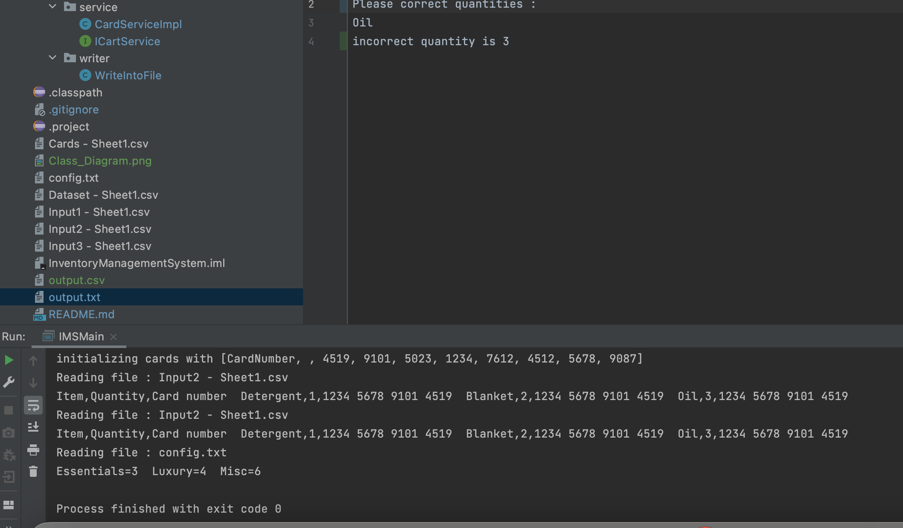
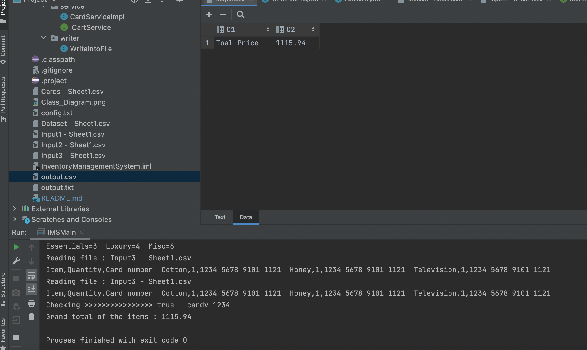

Inventory-Management-System
===========================

Installation
============

Quick Guide
-----------
1. Download, install and set the classpath from here [Java Development Kit] (https://www.guru99.com/install-java.html)
1. Download eclipse as an IDE to run the project from here [Eclipse ] (http://www.eclipse.org/downloads/)

How to use
==========

Usage
-----

### Running JAVA programs

The project will run from com.ims.main.IMSMain class : 
1. right click on com.ims.main.IMSMain
1. Run As -> Java Application

Run In CLI : 
javaw.exe -classpath ./bin com.ims.main.IMSMain

Design Patterns Used
============
1. We have followed SOLID Design Principle in creating the project.
1. We have followed chain of responsibility pattern. Each class has their own functions, they passed the obj to another class
1. We followed Factory pattern.  Factory pattern is one of the most used design patterns in Java. This type of design pattern comes under creational pattern as this pattern provides one of the best ways to create an object.
In Factory pattern, we create object without exposing the creation logic to the client and refer to newly created object using a common interface. We used IcartService interface here, so it won't be exposed to the outside.

- class diagram :
  

Results
==========

1.Input1-Sheets1.csv:
output is 36.68

2.Input2-Sheets2.csv:
exceed quantity

3.Input3-Sheets3.csv
output is 1115.94

